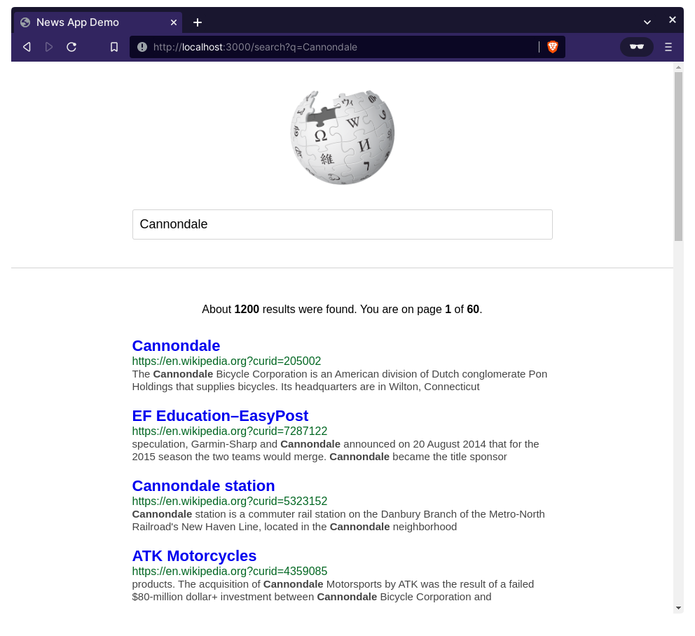

# Wikipedia Search (Logging in Go Demo)

This repository contains examples of
[Logging with Zerolog](https://github.com/betterstack-community/wikipedia-demo/tree/zerolog)
and
[Logging with Zap](https://github.com/betterstack-community/wikipedia-demo/tree/zap)
in a simple Go web application to give you an idea of how you can get started
with either package in your own projects.

Here are the accompanying tutorials:

- [A Complete Guide to Logging in Go with Zerolog](https://betterstack.com/community/guides/logging/zerolog/).
- [A Comprehensive Guide to Zap Logging in Go](https://betterstack.com/community/guides/logging/zerolog/).
- [A Comprehensive Guide to Structured Logging in Go (Slog)](https://betterstack.com/community/guides/logging/logging-in-go/).



## 🟢 Prerequisites

You must have the [latest version of Go](https://go.dev/doc/install) installed
on your machine. This project was tested against v1.20.

## 📦 Getting started

- Clone this repo to your machine:

```bash
git clone https://github.com/betterstack-community/wikipedia-demo
```

- `cd` into the project folder and switch to the relevant branch:

```bash
git checkout zerolog
git checkout zap
```

- Run `go mod tidy` to download dependencies.
- Execute the command below to start the development server:

```bash
go build && ./wikipedia-demo
```

- Visit [http://localhost:3000](http://localhost:3000) in your browser.
- Enter a search query, and view the corresponding logs in your console and in
  the `wikipedia-demo.log` file.

## ⚖ License

The code used in this project and in the linked tutorial are licensed under the
[Apache License, Version 2.0](LICENSE).

